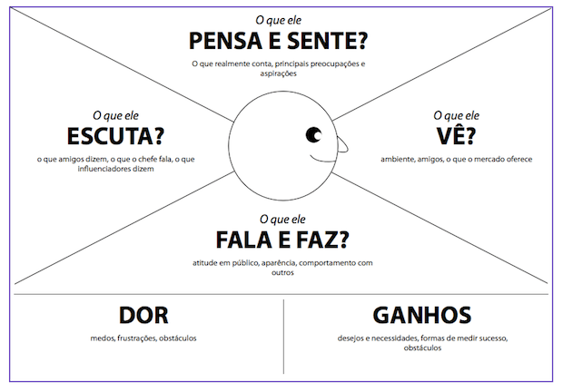

# **Tema escolhido:** Plataforma de Registro de Obras Literárias Lidas

Trabalho de Experiencia do Usuário (UX) apresentado ao Centro Universitário [FEI](https://portal.fei.edu.br/), como parte dos requisitos necessários para aprovação na disciplina de Experiência do Usuário e Front-End (CCP310) do curso de Ciencia da Computação, orientado pelo Prof. Dr. [Fagner de Assis Moura Pimentel](https://github.com/fagnerpimentel).

## Componentes do Grupo

- Yuri da Silva Shimoki
- Marcelo Boalento do Nascimento

## Resumo

Plataforma que busca auxiliar os usuários na organização das obras literárias já lidas.

## Introdução

- Contextualização: Leitores ávidos podem facilmente perder noção do que já leram ou não após anos de leitura. Isso pode ser problemático de algumas formas, como o leitor pode não intencionalmente comprar um livro já lido ou esquecer o nome de uma obra que ele gostou. Esta plataforma é necessária para resolver esses tipos de problemas que leitores frequentemente enfrentam e que só piora com o passar do tempo.
- Linha de resumo: Auxiliar o usuário no registro de livros lidos.
- Experiência que deve proporcionar: Uma experiência sem dificuldades e direta, tendo em vista a simplicidade da aplicação.

## Publico Alvo

- Público alvo: Leitores de 16 ou mais anos de idade buscando organizar suas leituras.

### Personas

- Quais informações sobre o usuário o serviço ou poduto deve guardar?

- Persona Primária: Leitor Ávido
  - Perfil: Adulto (25–45 anos), leitor frequente. Costuma ler vários livros por mês.
  - Contexto social: Participa de clubes de leitura, fóruns online e redes sociais literárias.
  - Contexto econômico: Classe média ou média-alta, com acesso a dispositivos móveis e internet de qualidade.
  - Contexto cultural: Alto interesse por literatura nacional e internacional, acompanha lançamentos editoriais e eventos literários.

- Persona Secundária: Leitor Casual
  - Perfil: Jovem adulto ou adulto (18–35 anos). Lê esporadicamente, motivado por indicações ou modas literárias.
  - Contexto social: Usa redes sociais para descobrir livros, segue influenciadores literários.
  - Contexto econômico: Classe média, acesso a smartphone e internet, mas não investe muito em livros físicos (prefere e-books ou bibliotecas).
  - Contexto cultural: Interesse variado, lê para lazer ou estudo, mas sem rotina fixa

 - Persona negativa: Desinteressado em Livros
   - Perfil: Prefere consumir conteúdo audiovisual (filmes, séries, vídeos curtos) e raramente lê livros.
   - Contexto econômico: Classe baixa ou média. Possui acesso a dispositivos e internet de alta velocidade, mas não investe em livros ou e-readers.
  - Contexto cultural: Não acompanha lançamentos literários, não participa de clubes de leitura e não tem interesse em registrar ou organizar leituras.

O serviço deve armazenas as seguintes informações sobre o usuário:
- Nome ou apelido
- Senha
- Lista de livros
  - A marcação de cada livro: lido, lendo e desejado.
  - Nota e/ou comentário em cada livro.

### Mapa de empatia

- Determine o mapa de empatia[^1] de pelo menos uma persona primária e uma sercundária.
  - O que o usuário vê: aqui estamos falando do ambiente visual em que o usuário se encontra. Ou seja, o que ele efetivamente enxerga, as pessoas e objetos que estão ao seu redor. Isso ajuda a entender o contexto em que o usuário está inserido e as influências visuais que está recebendo.
  - O que o usuário ouve: neste quadrante, buscamos entender o que o usuário está ouvindo, os sons que o cercam e como eles influenciam suas ações.
  - O que o usuário diz e faz: aqui consideramos ações e comportamentos que o usuário apresenta durante sua interação com serviço ou poduto.
  - O que o usuário pensa e sente: neste quadrante, buscamos entender os pensamentos, sentimentos, emoções e percepções que o usuário tem em relação ao serviço ou poduto. Quais expectativas o usuário cria sobre o serviço ou poduto?
  Que tipo de serviço ou poduto mais agrada essa persona?
  - Dores: quando falamos sobre dores do usuário, estamos fazendo referência a quaisquer obstáculos, necessidades ou frustrações que o usuário possa experimentar ao tentar realizar uma tarefa ou alcançar um objetivo. Isso inclui, por exemplo, problemas de usabilidade, dificuldades de acesso ou outros desafios que podem afetar a experiência do usuário.
  - Ganhos: nesse caso estamos falando de quaisquer benefícios ou recompensas que o usuário possa experimentar ao utilizar o serviço ou poduto. Isso pode incluir economia de tempo ou facilidade de uso, por exemplo. Que desejos do usuário o serviço ou poduto satisfaz?

## Contexto de uso

- Descreva o ambiente em que o serviço ou poduto deve ser utilizado.
- Qual/quais o(s) contexto(s) sociais, econômicos e culturais existentes neste ambiente?
- Quais informações sobre o ambiente, o serviço ou poduto deve guardar antes de iniciar a interação?
- O que normalmente deve estar acontecendo com o ambiente quando o usuário interagir com o serviço ou poduto?

## Jornada do usuário

- Criar uma narrativa para o o seu serviço ou poduto com o usuário.
- Determine o que o usuário realiza desde a primeira até o última interação com o serviço ou poduto.
  - Descreva o que acontece ou pode acontecer passo a passo
  - Como a tarefa começa? Como a tarefa se desenvolve? Como a tarefa termina?

## Análise de concorrência

- Pesquise serviços ou podutos existentes atualmente que possam realizar o objetivo deste projeto.
- Selecione pelo menos 3 serviços ou podutos diferentes.
- Em relação aos concorrentes, respondam as seguintes perguntas?
  - Existe plataforma similar que atende o mesmo mercado e funcionalidades? Se sim: Quais os pontos positivos? Quais os pontos negativos?
  - Existe plataforma diferente quanto ao serviço, mas que atenda esse mercado? Se sim: Quais os pontos positivos? Quais os pontos negativos?

## Coleta de dados

## Modelo de tarefas

## Design

- Pense nas características de Affordances do seu serviço ou poduto. 
    - Que tipo de acessibilidades devem ser consideradas dentro do seu projeto?
- Discuta o papel das expectativas do usuário no projeto deste serviço ou poduto. Qual a importância e pontos a serem considerados se você quiser vender esse serviço ou poduto?

### Prototipação em baixo nível (papel)
#### Avaliação heurística

### Prtotipação em médio nível (Figma)
#### Avaliação heurística

### Prtotipação em alto nível (React)
#### Avaliação heurística

[^1]: Fonte: Adaptado de <https://hazeshift.com.br/mapa-de-empatia/>

<!-- TODOs:
- Add exemplos
 -->

